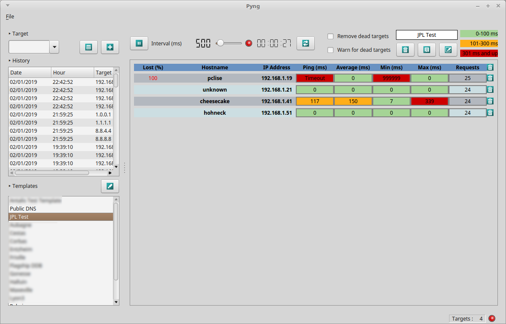
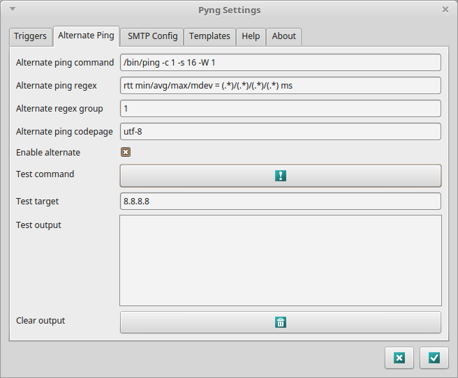
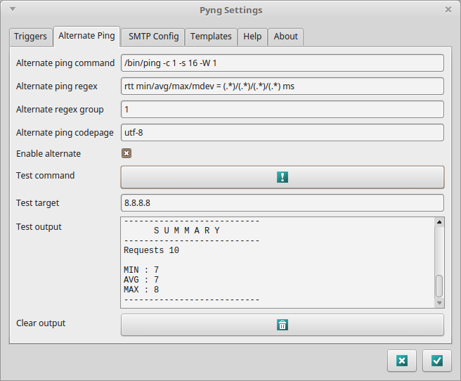
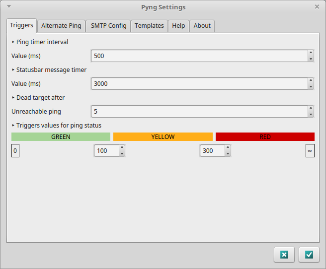
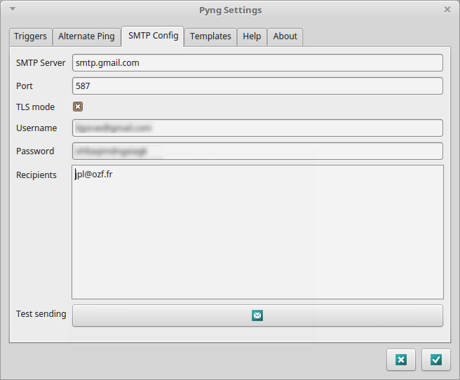
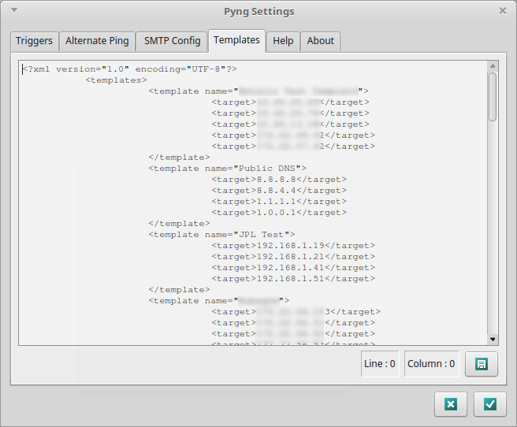
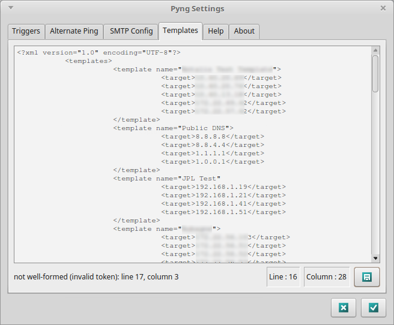

# PYNG | *My MultiPing GUI*

## Summary
- Pyng is a multi ping tool written in Python.
- Cross version (Python 2.x and Python 3.x)
- Cross platform (tested on Linux and Windows)
- Does not need administrator or root access.
- Easily configurable for misc OS version.
- Could be used as a monitoring tool with mail alerts.

## Getting started

### Prerequisites
- This program is supposed to run under **Windows** *(Windows 10 tested)* and **Linux** *(Ubuntu and Mint tested)* OS.
- Both **Python 2.x** and **Python 3.x** are supported.
- The GUI is using **Qt 4.x library PyQt4**.
- Executable packed with **PyInstaller** could be run without installing neither Python nor Qt libraries.

### Installing
- Copy all the files and directories with structure into a local user place.
- Main entry point for running the program is the **pyng.py** script.
- Binary program packed by PyInstaller could be run as a legacy OS executable.

### Configuring
- As a first try, you should test to ping the **Public DNS** template supplied by default.
- If the ping fails, you'll have to configure an **alternate ping command** compatible with your OS.

#### Alternate ping command
- As an example of alternate ping commands, here are the commands hardcoded in the program for Windows and Linux OS :

| OS | Alternate Ping Command | Alternate Ping Regex | Alternate Regex Group | Alternate Codepage |
| --- | --- | --- | :---: | --- |
| Windows | ping -n 1 -w 1 | Minimum = (.\*)ms, Maximum = (.\*)ms, Moyenne = (.\*)ms | 1 | windows-1252 |
| Linux | /bin/ping -c 1 -W 1 | rtt min/avg/max/mdev = (.\*)/(.\*)/(.\*)/(.\*) ms | 1 | utf-8 |

- The **ping command** defines how you ping a host from your machine; this command should be configured to get **only one** response (-n 1 for Windows, -c 1 for Linux)
- The **regex** defines the output you'll get from the ping command; in this output, each value is contained in a group represented by (.\*) 
- The goal is to fetch the value of the ping command from a group by supplying the number of the **group** containing your value.
- As you send only one request, all values (min, max, average) are the same, so you could fetch the group you want.
- As you could see, my Windows OS is in french, so depending of your version, you should have to change the regex to get the good value.
- Depending of your OS version, you may also have to change the **codepage**.

- All of these settings could be tested toward a specified or default target :

- The output panel is then showing you what has been understood.
- If the answer in the output panel seems to be correct, don't forget to enable this alternate ping command.

#### Triggers settings

- The **ping timer interval** is the duration between two consecutive ping requests in milliseconds.
- The **statusbar message timer** is the length of time the message remains displayed in the statusbar.
- The **dead target after xx unreachable ping** defines after how many timeout requests, the target is declared dead. This value is taken into account when sending alert emails.
- The **triggers values for ping status** 

#### SMTP settings

#### Templates

## Built with
- [Python](https://www.python.org)
- [PyQt4 library](https://pypi.org/project/PyQt4/)
- smtplib library
- [Axialis free icons library](http://www.axialis.com/free/icons) by [Axialis Team](http://www.axialis.com)
 
## Authors
- Main developper : **Jean-Pierre Liguori**

## License
- This project is licensed under the GNU General Public License - see the [LICENSE.md](LICENSE.md) file for details
